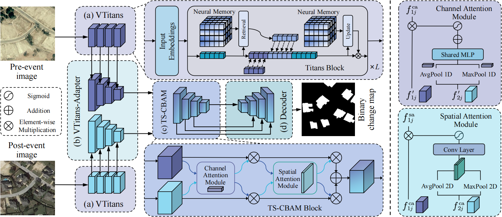

<h1 align="center">ChangeTitans</h1>

<h3 align="center">ChangeTitans: Remote Sensing Change Detection with Neural Memory</h3>

## 🔭Overview



## 🗝️Quick start on LEVIR dataset

1. Data preparation:

   - Download LEVIR dataset from [Here](https://justchenhao.github.io/LEVIR/) (Official) or [AI Studio](https://aistudio.baidu.com/datasetdetail/53795) (Spare).

   - Crop the images & masks into $256\times 256$ size.

   - Arrange them into the following format:

     ```
     data
     |- LEVIR_ABlabel
        |- A
           |- train_1_0_256_0_256.png
           |- ...
           |- val_1_0_256_0_256.png
           |- ...
           |- test_1_0_256_0_256.png
           |- ...
        |- B
           |- (same as above)
        |- label
           |- (same as above)
        |- list
           |- train.txt
           |- val.txt
           |- test.txt
     ```

     Here, each line of .txt file is a file name, like:

     ```
     train_1_0_256_0_256.png
     train_1_0_256_256_512.png
     train_1_0_256_512_768.png
     train_1_0_256_768_1024.png
     ...
     ```

2. Installation:

   - Clone this repository and navigate to the project directory:

     ```bash
     git clone https://github.com/
     cd ChangeTitans
     ```

   - Create and activate a new conda environment:

     ```bash
     conda create -n changetitans python=3.10
     conda activate changetitans
     ```

   - Install PyTorch according to CUDA or ROCm version (taking CUDA 12.1 as an example here): 

     ```bash
     pip install torch==2.5.1 torchvision==0.20.1 torchaudio==2.5.1 --index-url https://download.pytorch.org/whl/cu121
     ```

     👉 **Note that** we do not recommend you to use torch versions lower than **2.0.0**.

   - Install other dependencies:

     ```bash
     pip install -r requirements.txt
     cd model/vtitans/ops & sh make.sh & cd ../../..
     ```

3. Download Pretrained Weight:

   - Please download the pretrained weight of our [VTitans](https://github.com/ChangeTitans/ChangeTitans/releases/download/v0.1/vtitans_in1k.pth) and put it under **project_path/ckpt/**.

4. Train:

   ```bash
   python train.py --pretrain_dir 'ckpt/vtitans_in1k.pth'
   ```

5. Benchmark:

   - Please download the weight of our [ChangeTitans](https://github.com/ChangeTitans/ChangeTitans/releases/download/v0.1/changetitans_levir.pth) and put it under **project_path/ckpt/**.

   - Test:

     ```bash
     python test.py --model_path 'ckpt/changetitans_levir.pth'
     ```

## 🤝Acknowledgments
This project is based on [titans-pytorch](https://github.com/lucidrains/titans-pytorch), [Vision-RWKV](https://github.com/OpenGVLab/Vision-RWKV), [ViT-Adapter](https://github.com/czczup/ViT-Adapter), and [AFCF3D-Net](https://github.com/wm-Githuber/AFCF3D-Net). Thanks for their excellent works!!
